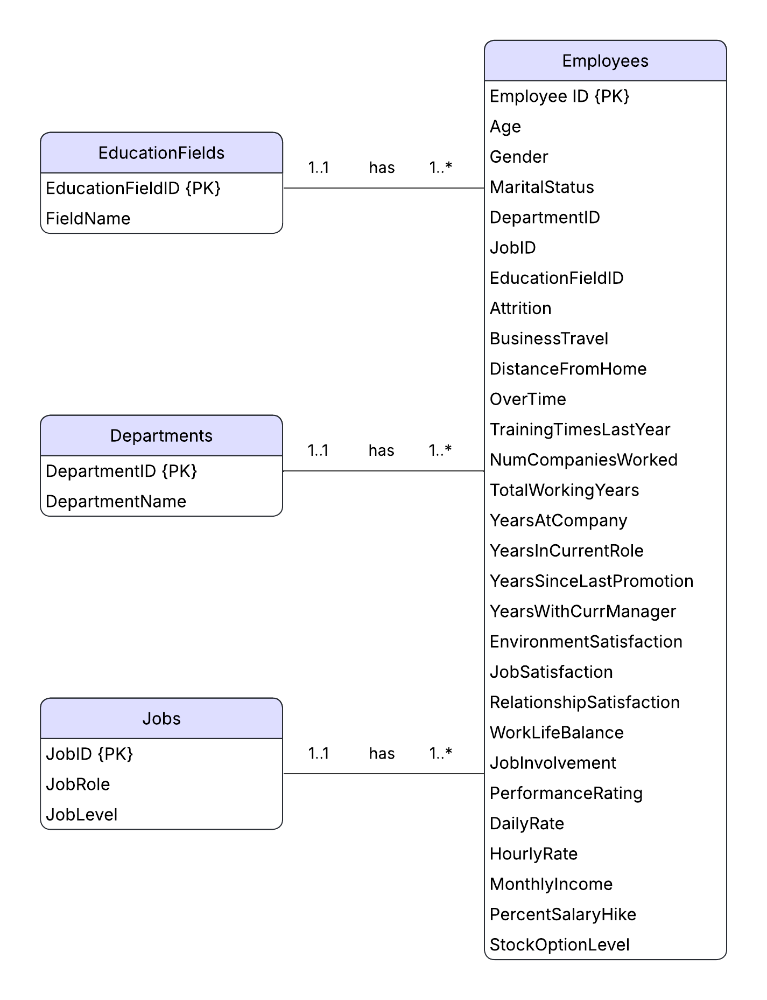

# Employee Attrition Dashboard
[](https://opensource.org/licenses/MIT)


**Analyzing employee data to uncover key factors influencing attrition, providing insights for HR strategies.**

## Table of Contents
- [Visual Demo](#visual-demo)
  - [Employee Attrition Dashboard](#employee-attrition-dashboard)
  - [Employee Management page](#employee-management-page)
- [Overview](#overview)
- [Data Source & Dictionary](#data-source--dictionary)
- [Features](#features)
- [Technologies Used](#technologies-used)
- [Required Libraries](#required-libraries)
- [Database Schema](#database-schema)
- [How to Run](#how-to-run)
- [Key Insights](#key-insights)
- [Project Structure](#project-structure)
- [Results](#results)
- [Author & Acknowledgments](#author--acknowledgments)
- [License](#license)

## Visual Demo
### Employee Attrition Dashboard


### Employee Management page


## Overview

The Employee Attrition Dashboard is an interactive web application built with Dash and Plotly that provides comprehensive insights into employee attrition patterns within an organization. This dashboard enables HR professionals and managers to:

- Visualize attrition rates across different departments, job roles, and demographics
- Identify key factors influencing employee turnover
- Manage employee data through an intuitive interface

The application connects to an SQLite database containing employee information and provides both analytical visualizations and data management capabilities.

## Data Source & Dictionary
**Data Source**  
This project uses the [IBM HR Analytics Employee Attrition & Performance dataset](https://www.kaggle.com/datasets/pavansubhasht/ibm-hr-analytics-attrition-dataset/data), available on Kaggle.  
The dataset contains detailed employee-level information such as demographics, job role, performance, and attrition status.  

**Data Dictionary (Key Columns)**  

- **Attrition**: Whether an employee left the company (Yes/No).  
- **Age**: Age of the employee.  
- **BusinessTravel**: Frequency of business travel (Non-Travel, Travel_Rarely, Travel_Frequently).  
- **Department**: Department the employee belongs to (Sales, Research & Development, Human Resources).  
- **EducationField**: Field of study of the employee (Life Sciences, Medical, Marketing, Technical Degree, etc.).  
- **Gender**: Gender of the employee.  
- **JobRole**: Job title/position of the employee.  
- **MaritalStatus**: Marital status (Single, Married, Divorced).  
- **MonthlyIncome**: Monthly salary.  
- **NumCompaniesWorked**: Number of companies the employee has worked at before.  
- **OverTime**: Whether the employee works overtime (Yes/No).  
- **PerformanceRating**: Performance rating score.  
- **TotalWorkingYears**: Total years of professional experience.  
- **YearsAtCompany**: Number of years the employee has been at the company.  
- **YearsInCurrentRole**: Number of years the employee has been in the current role.  
- **YearsSinceLastPromotion**: Years since the employee’s last promotion.  
- **YearsWithCurrManager**: Number of years the employee has been with their current manager.  

## Features

- **Interactive Visualizations**: Bar charts, violin plots, and heatmaps showing attrition patterns
- **Department Filtering**: Analyze attrition by specific departments
- **Employee Management**: Add new employees and update existing records
- **Responsive Design**: Clean, modern UI with custom styling

## Technologies Used

- **Backend**: Python 3.10 
- **Web Framework**: Dash 
- **Visualization**: Plotly 
- **Data Processing**: Pandas , NumPy 
- **Database**: SQLite 
- **Statistical Analysis**: scikit-learn , statsmodels 

## Required Libraries

To run this project, you need to install the following Python packages:

```bash
pip install dash
pip install plotly
pip install pandas
pip install numpy
pip install scikit-learn
pip install statsmodels
```

## Database Schema
The application expects an SQLite database (`employee_database.db`) with the following tables:

- Employees (EmployeeID, DepartmentID, JobID, MonthlyIncome, OverTime, Attrition, etc.)
- Departments (DepartmentID, DepartmentName)
- Jobs (JobID, JobRole, JobLevel)
- EducationFields (EducationFieldID, FieldName)


## How to Run
1. Clone the repository:
```bash
git clone <repository-url>
cd <repository-directory>
```

2. Install required dependencies:
```bash
pip install -r requirements.txt
```
3. Run the application:
```bash
python app.py
```

4. Access the dashboard:
Open your web browser and navigate to `http://127.0.0.1:8050/`


## Key Insights
Based on the analysis performed:

1. Primary Factors Influencing Attrition:
    - Job Role (Sales Representatives have 40% attrition rate)
    - Overtime (Employees working overtime have 31% attrition rate)
    - Marital Status (Single employees have 26% attrition rate)
    - Business Travel (Frequent travelers have 25% attrition rate)

2. Secondary Influencing Factors:
    - Education Field (Human Resources employees have 26% attrition rate)
    - Job Level (Lower levels correlate with higher attrition)
    - Monthly Income (Lower income correlates with higher attrition)
    - Tenure-related metrics (Less experience correlates with higher attrition)

3. Weaker Correlations:
    - Job Satisfaction & Environment Satisfaction
    - Daily Rate & Hourly Rate

4. Minimal to NO Impact Factors:
    - Salary Hike
    - Stock Option Level
    - Training Times Last Year
    - Relationship Satisfaction

## Project Structure
```text
├── app.py                 # Main Dash application
├── data/
│   │── WA_Fn-UseC_-HR-Employee-Attrition.csv   # Original data
│   └── cleanData.csv  
├── db/
│   │── employee_database.db  # SQLite database file
│   └── ERdiagram.png  # Er diagram image
├── notebooks/
│   └── Employee Attrition notebook.ipynb # Notebook
├── demo/
│   │── Dashboard.gif  
│   └── EmployeeManagement.gif
├── requirements.txt
├── LICENSE
├── .gitignore
└── README.md             # Project documentation
```

## Results
The dashboard provides actionable insights into employee attrition patterns, helping organizations:

- Identify high-risk departments and job roles
- Monitor the effectiveness of HR initiatives
- Make data-driven decisions about workforce management

## Author & Acknowledgments

### Author:
- Waref Alyousef

### Acknowledgments:

This project uses the IBM HR Analytics Employee Attrition & Performance dataset, made available on Kaggle by <a href="https://www.kaggle.com/datasets/pavansubhasht/ibm-hr-analytics-attrition-dataset/data" target="_blank">
  Pavan Subhash T
</a>

I gratefully acknowledge the dataset provider for making this data accessible for analysis and learning.

## License

[](https://opensource.org/licenses/MIT)
This project is licensed under the MIT License - see the [LICENSE](LICENSE) file for details.
